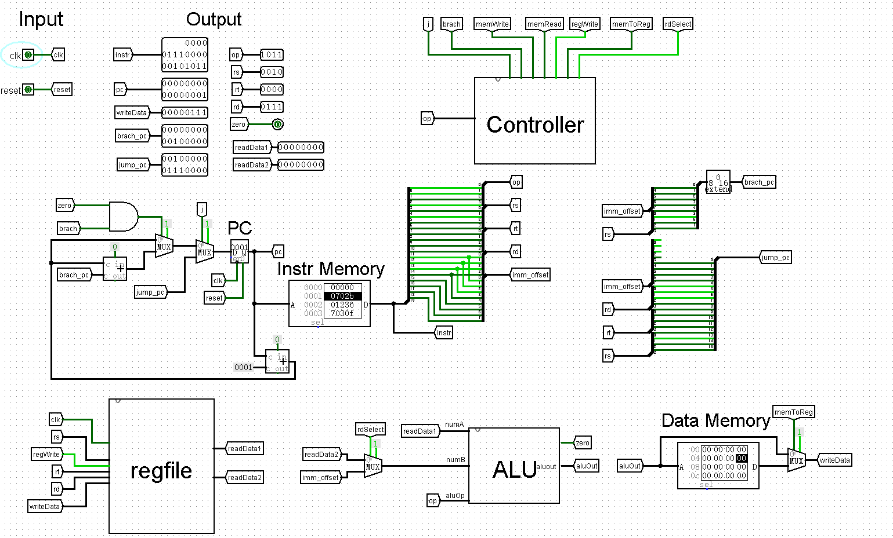

# logisim_simple_cpu
I designed a simple ISA and cpu by logisim.

这是一个简单的从设计ISA到利用ligisim软件设计CPU的项目。我们将首先定义自己简单的ISA，然后在此基础上完成一个8bit的CPU。


### 目录

```
ALU.circ 			// CPU的成品设计文件
logisim-win-2.7.1 	// logisim软件
instr 				// 测试CPU的指令文件
```


### ISA设计

##### 设计二进制代码为20位

- operation code ：[0:3]
- 设置三个寄存器操作数，两个操作数将结果存储在一个输入寄存器中。
- 每个寄存器占4位，即2^4=16 个寄存器

|          name          | op[0:3] |      [4:7]       |      [8:11]      |      [12:15]      | [16:19]            |                         description                          |
| :--------------------: | :-----: | :--------------: | :--------------: | :---------------: | ------------------ | :----------------------------------------------------------: |
|          add           |  0000   |        rs        |        rt        |        rd         | 0000               |               Arithmetic addition(rs = rt+rd)                |
|         incre          |  0001   |        rs        |        rt        |       0000        | 0000               |                     increment(rs = rt+1)                     |
|         decre          |  0010   |        rs        |        rt        |       0000        | 0000               |                     decrement(rs = rt-1)                     |
|          cmp           |  0011   |        rs        |        rt        |        rd         | 0000               | comparison(with 3 output:equals in rs[0], less than in rs[1], greater than in rs[2] ) |
|          not           |  0100   |        rs        |        rt        |       0000        | 0000               |                logic bitwise not(rs = not rt)                |
|          and           |  0101   |        rs        |        rt        |        rd         | 0000               |                        rs = rt and rd                        |
|           or           |  0110   |        rs        |        rt        |        rd         | 0000               |                        rs = rt or rd                         |
| rls(right logic shift) |  0111   |        rs        |        rt        |        rd         | 0000               |                        rs = rt >> rd                         |
| lls(left logic shift)  |  1000   |        rs        |        rt        |        rd         | 0000               |                        rs = rt << rd                         |
|           lw           |  1001   |        rs        |     rt(base)     |      offset       | offset             |                     rs = mem[rt+offset]                      |
|           sw           |  1010   |        rs        |     rt(base)     |      offset       | offset             |                     mem[rt+offset] = rs                      |
|          addi          |  1011   |        rs        |        rt        |        imm        | imm                |                         rs = rt+ imm                         |
|          andi          |  1100   |        rs        |        rt        |        imm        | imm                |                       rs = rt and imm                        |
|          ori           |  1101   |        rs        |        rt        |        imm        | imm                |                        rs = rt or imm                        |
|          JMP           |  1110   | instr_index[0:3] | instr_index[4:7] | instr_index[8:11] | instr_index[12:15] |                                                              |
|          CJMP          |  1111   |   offset[0:3]    |        rt        |        rd         | offset[4:7]        |  cjmp rs,rd,pc;offset;   rt == rd: j (offset) else:continue  |


### CPU设计

设计参考mips的单周期CPU设计

- 分为 取指、译码、控制、regfile寄存器堆、dataram几个模块。
- 输入clk信号（暂时是输入端口，方便手动调试，未用clock模块）
- 输入复位信号
- 输出指令、pc、写回寄存器堆数据、branch的pc、jump的pc、instr的译码结果、regfile读出结果




### 调试

如下设计了一组能够测试大部分设计的代码。

instruction ram中装入的测试指令如下，依次：行号 | 汇编代码 | 二进制机器码 | 十六进制机器码

```
0 : addi $s1,$0,5       00000101000000011011 501b
1 : addi $s2,$0,7       00000111000000101011 702b
2 : or   $s3,$s2,$s1    00000001001000110110 1236
3 : cjmp $s3,$s0,7      01110000001100001111 7030f
4 : and  $s4,$s0,$s2    00000010000001000101 2045
5 : cjmp $s4,$s0,7      01110000010000001111 7020f
6 : add  $s5,$s1,$s2    00000010000101010101 2155
7 : jmp  9              10010000000000001110 9000e
8 : add  $s6,$s1,$s2    00000010000101100000 2160
9 : add  $s7,$s1,$s2    00000010000101110000 2170
10: add  $s8,$s1,$s2    00000010000110000000 2180
```

调试步骤：

1. 将instr文件载入instr mem中
2. 选择logisim的手掌方式
3. 点击复位
4. 点击clk输入模块模拟时钟上升沿触发cpu
5. 查看寄存器的输入输出是否正确，写回数据是否正确，跳转pc是否正确


### 缺陷（埋坑）

1. 在大小端的设计上，在logisim中从ram中读取出来的是大端方式，故在将汇编指令翻译为机器码时采用相反设计时的从低到高，将op放在[16:19]位置，然后左侧是rs rt rd的顺序，如此在logisim中读出来op会在[0:3]位。

